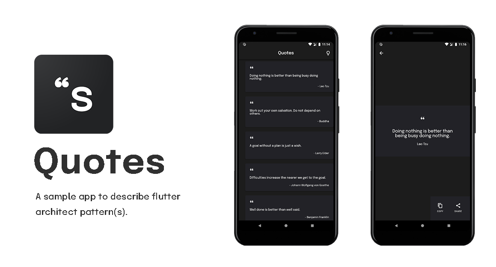

# Flutter Quotes

A quotes app to demonstrate flutter state management pattern(s).

> _Currently it's build using bloc, mobx pattern but I'll add few more sooner into their separate branches as I learn them._ ❤️

[](https://github.com/KaustubhPatange/FlutterQuotes/releases/download/v1.0.1/app-release.apk)

## State Patterns

- **Bloc** - Switch to `master` branch to see the implementation using _Bloc/Provider_ state-management.
- **Mobx** - Switch to `mobx` branch to see the implementation using _Mobx_ state-management.

## Built With 🛠

- [Flutter](https://flutter.dev/) - A toolkit for building beautiful, natively compiled applications for all platforms.
- [Bloc](https://pub.dev/packages/flutter_bloc) - A state management library for flutter.
- [Mobx](https://pub.dev/packages/mobx) - A reactive state management library for flutter.
- [Injectable](https://pub.dev/packages/injectable) - A dependency injection library inspired by Angular DI.
- [Lazy load scrollview](https://pub.dev/packages/lazy_load_scrollview) - To support pagination for listview.

## Contribute

If you want to contribute to this library, you're always welcome! [See Contributing Guidelines](CONTRIBUTING.md).

## License

```
MIT License

Copyright (c) 2020 Kaustubh Patange

Permission is hereby granted, free of charge, to any person obtaining a copy
of this software and associated documentation files (the "Software"), to deal
in the Software without restriction, including without limitation the rights
to use, copy, modify, merge, publish, distribute, sublicense, and/or sell
copies of the Software, and to permit persons to whom the Software is
furnished to do so, subject to the following conditions:

The above copyright notice and this permission notice shall be included in all
copies or substantial portions of the Software.

THE SOFTWARE IS PROVIDED "AS IS", WITHOUT WARRANTY OF ANY KIND, EXPRESS OR
IMPLIED, INCLUDING BUT NOT LIMITED TO THE WARRANTIES OF MERCHANTABILITY,
FITNESS FOR A PARTICULAR PURPOSE AND NONINFRINGEMENT. IN NO EVENT SHALL THE
AUTHORS OR COPYRIGHT HOLDERS BE LIABLE FOR ANY CLAIM, DAMAGES OR OTHER
LIABILITY, WHETHER IN AN ACTION OF CONTRACT, TORT OR OTHERWISE, ARISING FROM,
OUT OF OR IN CONNECTION WITH THE SOFTWARE OR THE USE OR OTHER DEALINGS IN THE
SOFTWARE.
```
